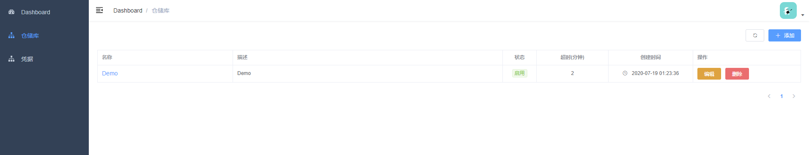
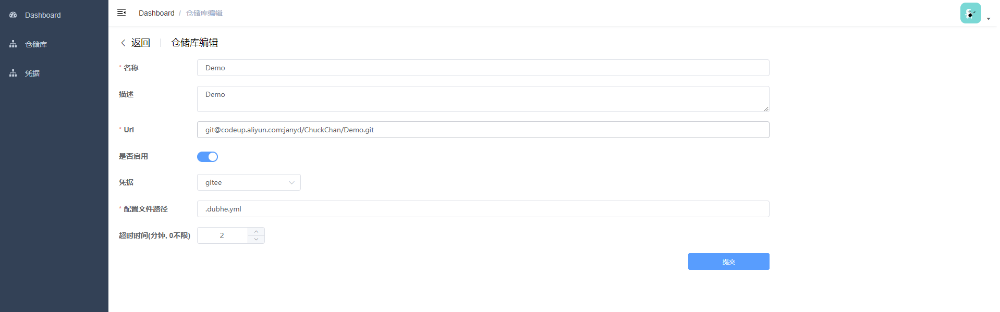
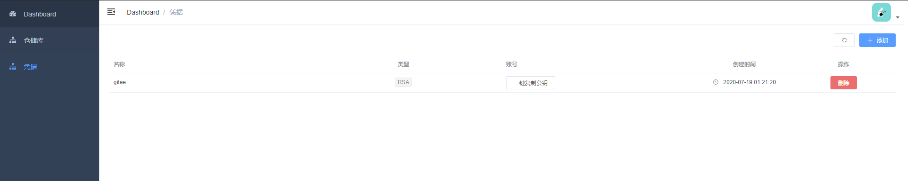
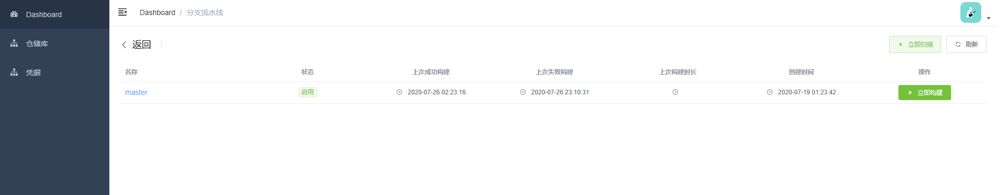
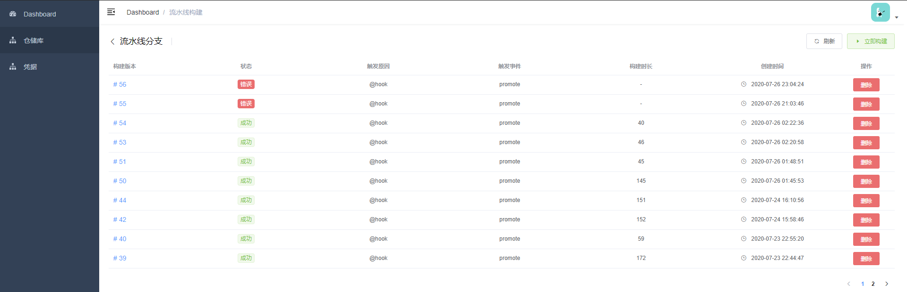
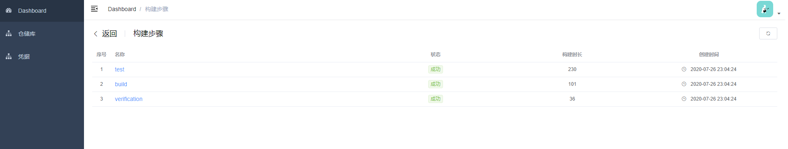
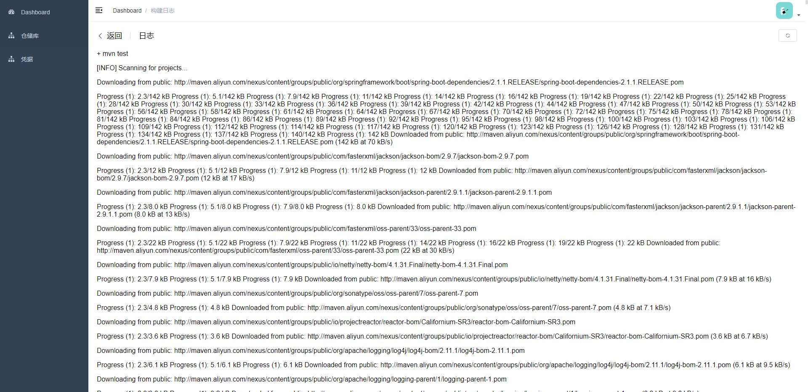

# Dubhe轻量级持续集成系统
与本项目相配前端项目在[Dubhe-dashboard-ui](https://github.com/Janyd/dubhe-dashboard-ui)

## 项目背景
Jenkins 是基于 Java 编写开源的CI工具，并且含有丰富的插件扩展并且支持集群模式。但是由于公司服务器资源不足，在网上找了下：
* [Drone](https://drone.io/)
* [GitLab CI](https://about.gitlab.com/)
* [Travis CI](https://travis-ci.org/)
* [TeamCity](https://www.jetbrains.com/teamcity/?utm_source=code-maze&utm_medium=cpc&utm_campaign=teamcity)  
...  
以上CI工具都各有优缺点，为了能够与公司内部系统结合起来，所以决定写一个CI工具：**Dubhe轻量级持续集成系统**  

## 功能
1. 仓库管理：与Git仓库对应，类似Jenkins中的Item
2. 凭据管理：如果Git仓库需要认证，则需要在此添加相关秘钥等等

## 环境依赖
* Go 1.13以上(暂时没试过1.13之前版本)
* Docker 1.17+(暂时没试过1.17之前版本)

## 安装
进入项目目录中的`cmd`后执行以下命令，`-o` 后面是生成执行文件名称以下是 Windows 环境，如果是 Max 或 Linux 环境不需要带后缀`.exe` 
```bash
go build -o dubhe.exe
```

然后利用生成的执行文件执行一下命令`-c`或者`-config`指定配置文件
```bash
dubhe.exe -c <配置文件>
```
配置文件模板如下
```toml
# 工作空间
workspace = "E:\\dubhe-workspace"

# 构建并发数
capacity = 2

# http端口
[http]
address = ":8000"

[server]
# gRPC 监听地址
address = ":9090"
# 使用网络
network = "tcp"

[database]
# 是否开启调试模式
debug = false
# 数据库类型(目前支持的数据库类型：mysql/sqlite3)
db_type = "sqlite3"
# 数据库链接地址 mysql:  <user>:<password>@tcp(<host>:<port>)/<dbname>?<parameters> sqlite3: path
dsn = "dubhe.db"
# 设置连接可以重用的最长时间(单位：秒)
max_lifetime = 7200
# 设置数据库的最大打开连接数
max_open_conns = 150
# 设置空闲连接池中的最大连接数
max_idle_conns = 50

[log]
# 日志级别(1:fatal 2:error,3:warn,4:info,5:debug)
level = 5
# 日志格式（支持输出格式：text/json/nested）
format = "nested"
# info日志文件输出位置
info_path = ""
# error日志文件输出位置
error_path = ""

[jwt]
# 签名key
signing_key = "gJbQry0vb02IjHQyKWlxQwZAwwZ7IC0e"
# 过期时间（单位秒）
expired = 7200

# 超级管理员账号
[super_user]
nickname = "Admin"
username = "admin"
password = "admin"
```


## 使用
在相关项目根目录编写`.dubhe.yml`，然后在`Dubhe`中添加仓储配置好Git代码。以下就是`.dubhe.yml`样例：
```yaml
# 定义配置类型(目前仅有pipeline)
kind: pipeline
# 执行的环境(目前仅有Docker，后续考虑增加宿主机环境)
type: docker
name: default

# 步骤
steps:
  # 步骤名称
  - name: test
    # 环境镜像
    image: maven:3.6.3-openjdk-8-slim
    # 执行的命令脚本
    commands:
     - mvn test
    # 有时候我们需要挂载宿主机的相关内容，在步骤配置的挂载路径是容器内部的路径，在下面会有与之对应volumes.name
    volumes:
      # 挂载卷名称
      - name: repository
        path: /root/.m2

  - name: build
    image: maven:3.6.3-openjdk-8-slim
    commands:
      - mvn -U clean package -Dmaven.test.skip=true
    volumes:
      - name: repository
        path: /root/.m2

  - name: verification
    image: alpine:latest
    # 可以编写 shell脚本
    commands:
      - if [ -e ruoyi-admin/target/*.jar ]; then exit 0; else exit 1; fi

# 挂载卷宿主机路径此处name需要与步骤挂载卷相对应才可以相应的挂载
volumes:
  - name: repository
    host:
      path: /Users/janyd/.m2
```
以上是Java Maven项目测试、构建打包与验证包过程。其实与`Drone`的配置文件大庭相径，此处也是借鉴了`Drone`的优秀设计

## 原理
本项目参考了`Jenkins`, `Drone`, `GitLab`等优秀项目，其中`Drone`参考了大量的设计，例如Runner、Trigger、Scheduler都是从`Drone`借鉴而来的设计。  

项目中编写好`.dubhe.yml`配置文件，其中定义CI步骤内容与环境，在`Dubhe`添加相关仓库配置好Git代码库，开始构建通过[go-git](github.com/go-git/go-git/v5)来拉取代码，
读取项目中`.dubhe.yml`配置文件，依据配置文件定义步骤环境拉取相关镜像，然后开始执行启动相关环境容器然后在容器中执行相关命令脚本。


## 截图
#### 仓储管理


#### 仓储编辑


#### 凭据管理


#### 仓储分支列表


#### 分支构建历史


#### 单次构建步骤视图


#### 构建步骤执行日志


## 主要使用的库
* [Drone](https://github.com/drone/drone)
* [Drone-runner-docker](https://github.com/drone-runners/drone-runner-docker)
* [Go-git](https://github.com/go-git/go-git)
* [Wire](https://github.com/google/wire)
* [Gin](https://github.com/gin-gonic/gin)
* [Xorm](https://gitea.com/xorm/xorm)
* [Toml](https://github.com/BurntSushi/toml)

## License
[Apache](https://github.com/Janyd/dubhe-ci/blob/master/LICENSE) license.